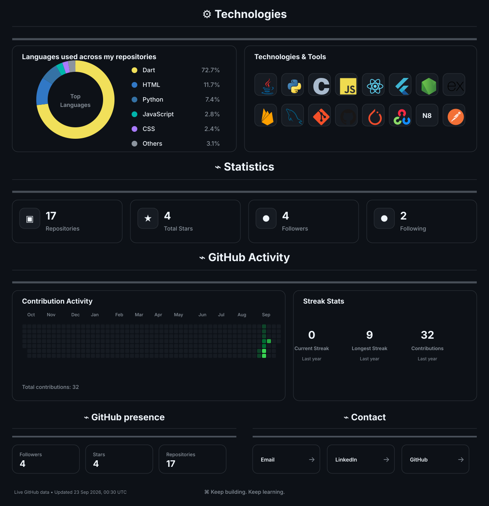

 

 

<a href="#about-me">ABOUT ME</a>
&nbsp;&nbsp;•&nbsp;&nbsp;
<a href="#github-dashboard">GITHUB DASHBOARD</a>
&nbsp;&nbsp;•&nbsp;&nbsp;
<a href="#contact">CONTACT</a>

 

<!-- ========================================================= -->
<!--                        ABOUT ME                           -->
<!-- ========================================================= -->

<h2 align="center" id="about-me">⌘ About me</h2>

<table>
<tr>

<td width="62%" valign="top">

<b>Hey! I'm Jitanka 👋</b>

I'm a developer who enjoys turning ideas into useful software
and understanding what happens behind the interfaces we use
every day. I like taking an idea from a rough concept and
gradually turning it into something functional, polished and
actually usable.

My interests sit somewhere between <b>software development</b>
and <b>artificial intelligence</b>. I enjoy building web and
mobile applications, working with backend systems, and
experimenting with AI-powered features and intelligent
applications.

I'm especially interested in understanding the complete picture —
from designing an interface and connecting APIs to working with
databases, models and the systems that make an application work
behind the scenes.

 

<b>Currently exploring</b>

  

<code>Full-Stack Development</code>
&nbsp;
<code>AI / ML</code>
&nbsp;
<code>LLMs</code>
&nbsp;
<code>Backend Systems</code>

</td>

<td width="38%" align="center" valign="middle">

  

<code>jitanka@github:~$</code>

<code>building ideas...</code>
 
<code>learning things...</code>
 
<code>shipping projects...</code>

</td>

</tr>
</table>

 

<!-- ========================================================= -->
<!--                    GITHUB DASHBOARD                       -->
<!-- ========================================================= -->

<h2 align="center" id="github-dashboard">⚙ GitHub Dashboard</h2>

<b>Automatically refreshed GitHub profile analytics</b>

 

 

<!-- ========================================================= -->
<!--                         CONTACT                           -->
<!-- ========================================================= -->

<h2 align="center" id="contact">⌁ Contact</h2>

&nbsp;

&nbsp;

 

<!-- ========================================================= -->
<!--                       PROFILE VIEWS                       -->
<!-- ========================================================= -->

 

<i>⌘ Keep building. Keep learning.</i>

