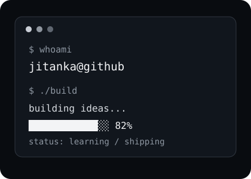
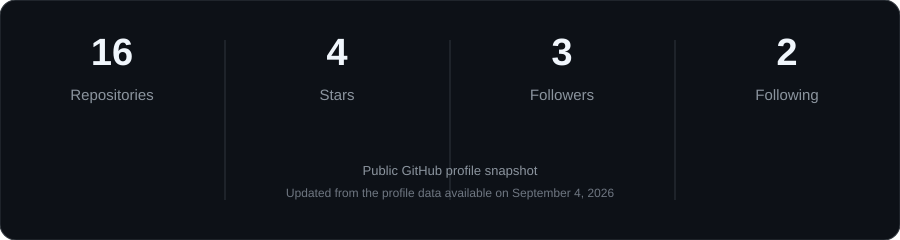
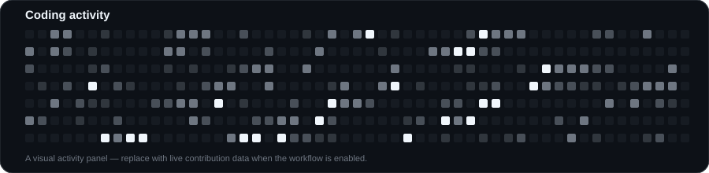

 

 

<a href="#about-me">ABOUT ME</a>
&nbsp;&nbsp;•&nbsp;&nbsp;
<a href="#technologies">TECHNOLOGIES</a>
&nbsp;&nbsp;•&nbsp;&nbsp;
<a href="#statistics">STATISTICS</a>
&nbsp;&nbsp;•&nbsp;&nbsp;
<a href="#contact">CONTACT</a>

 

<h2 align="center" id="about-me">⌘ About me</h2>

<table>
<tr>

<td width="60%" valign="middle">

<b>Hey! I'm Jitanka 👋</b>

  

A developer who enjoys building things,
solving problems and learning how technology
works under the hood.

  

I work across

  

  

<code>Full-Stack</code>
&nbsp;
<code>AI / ML</code>
&nbsp;
<code>LLMs</code>
&nbsp;
<code>Backend</code>

</td>

<td width="40%" align="center">

 

<code>jitanka@github:~$</code>

</td>

</tr>
</table>

 

<h2 align="center">⚙ Technologies</h2>

<h2 align="center">⌁ Statistics</h2>

 

 

<h2 align="center">⌁ GitHub presence</h2>

 

<h2 align="center" id="contact">⌁ Contact</h2>

 

 

<i>⌘ Keep building. Keep learning.</i>

